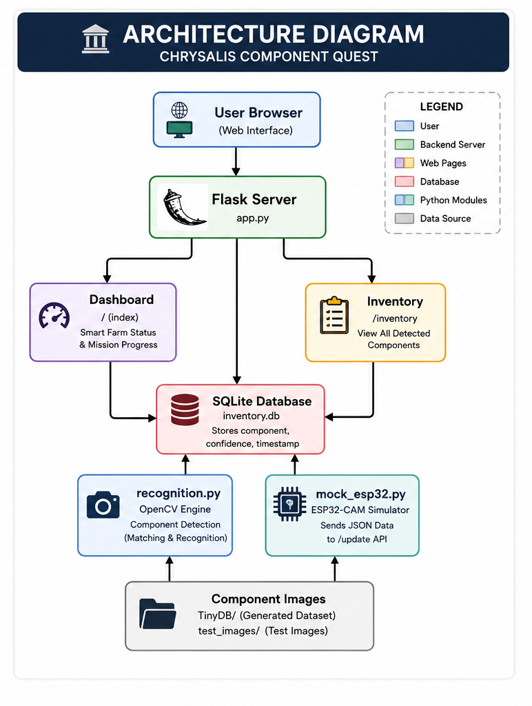
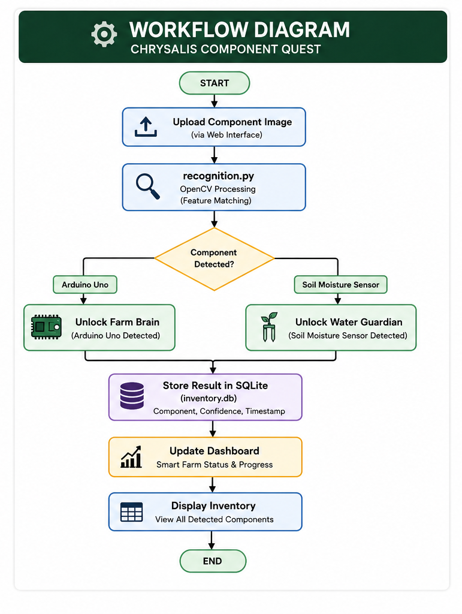
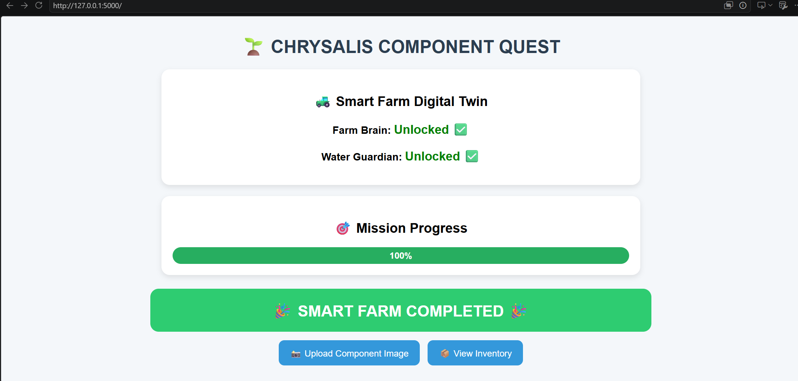
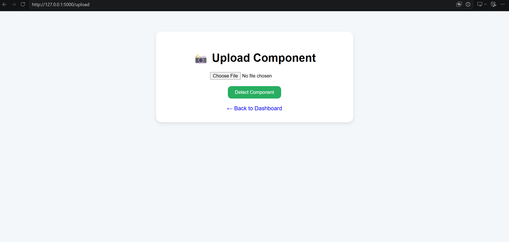
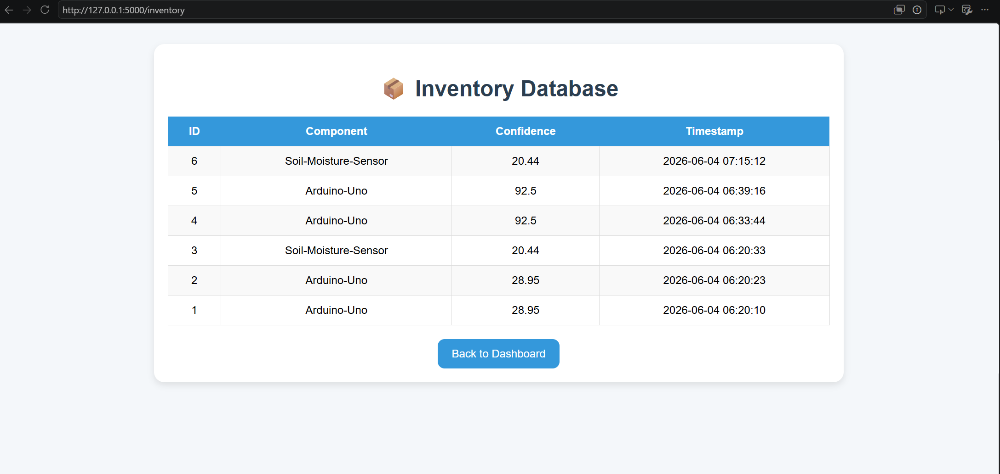

# 🌱 CHRYSALIS Component Quest – Smart Farm Edition

A software-based simulation of an IoT-powered Smart Farm Digital Twin developed as part of the CHRYSALIS Internship Program.

This project demonstrates how electronic components can be recognized using image processing techniques and integrated into a Smart Farm ecosystem through a Flask-based web application, inventory database, and ESP32-CAM simulation workflow.

---

# 📌 Project Overview

The objective of this project is to simulate an intelligent component recognition system that identifies electronic components and unlocks corresponding Smart Farm assets.

In a real-world implementation, an ESP32-CAM captures images of electronic components and sends recognition results to a backend server. Since physical hardware was unavailable during development, a complete software simulation was created to emulate the same workflow.

The system consists of:

* Image Recognition Engine (OpenCV)
* Flask Backend Server
* Smart Farm Dashboard
* SQLite Inventory Database
* Mock ESP32-CAM Simulator
* Inventory Tracking System
* Digital Twin Visualization

---

# 🚀 Features

## Component Recognition

* Detects electronic components from uploaded images
* Supports:

  * Arduino Uno
  * Soil Moisture Sensor
* Performs image preprocessing:

  * Grayscale conversion
  * Resizing to 32×32 pixels
  * Pixel comparison

## Smart Farm Digital Twin

Unlocks virtual farm assets based on recognized components:

| Component            | Smart Farm Asset |
| -------------------- | ---------------- |
| Arduino Uno          | Farm Brain       |
| Soil Moisture Sensor | Water Guardian   |

## Inventory Management

* Stores all recognized components
* Tracks confidence score
* Records timestamp of detection
* Persistent SQLite database storage

## ESP32-CAM Simulation

* Simulates real hardware communication
* Sends JSON payloads to Flask API
* Mimics ESP32-CAM workflow without hardware

## Dashboard

* Displays unlocked assets
* Shows mission completion percentage
* Provides inventory access

---

# 🏗️ System Architecture

The system is composed of the following modules:

1. User Interface
2. Flask Application Server
3. Recognition Engine
4. SQLite Database
5. Inventory Dashboard
6. ESP32 Simulator

## 🏗️ Architecture Diagram



---

# 🔄 Workflow

1. User uploads a component image.
2. OpenCV preprocesses the image.
3. Recognition engine compares the image against reference images.
4. Component is identified.
5. Detection result is stored in SQLite.
6. Smart Farm assets are unlocked.
7. Dashboard updates automatically.
8. Inventory database records the event.

## 🔄 Workflow Diagram



---

# 🖥️ Technologies Used

### Backend

* Python
* Flask

### Computer Vision

* OpenCV
* NumPy

### Database

* SQLite3

### Frontend

* HTML5
* CSS3
* Jinja2 Templates

### Version Control

* Git
* GitHub

---

# 📂 Project Structure

```text
CHRYSALIS_Component_Quest/
│
├── app.py
├── recognition.py
├── database_generator.py
├── database_manager.py
├── create_db.py
├── mock_esp32.py
├── inventory.db
├── requirements.txt
├── README.md
│
├── TinyDB/
│   ├── Arduino-Uno/
│   └── Soil-Moisture-Sensor/
│
├── templates/
│   ├── index.html
│   ├── upload.html
│   └── inventory.html
│
├── docs/
│   ├── User_Manual.md
│   ├── Architecture_Diagram.png
│   ├── Workflow_Diagram.png
│   ├── dashboard_complete.png
│   ├── inventory_page.png
│   └── upload_page.png
│
├── esp32_dummy/
│   └── firmware.ino
│
└── test_images/
```

---

# ⚙️ Installation

## Clone Repository

```bash
git clone https://github.com/YOUR_USERNAME/CHRYSALIS_Component_Quest.git
cd CHRYSALIS_Component_Quest
```

## Create Virtual Environment

```bash
python -m venv venv
```

### Windows

```bash
venv\Scripts\activate
```

### Linux / Mac

```bash
source venv/bin/activate
```

## Install Dependencies

```bash
pip install -r requirements.txt
```

---

# 🗄️ Create Database

Run:

```bash
python create_db.py
```

This generates:

```text
inventory.db
```

---

# ▶️ Running the Application

Start Flask:

```bash
python app.py
```

Open browser:

```text
http://localhost:5000
```

---

# 📸 Upload-Based Detection

1. Open:

```text
http://localhost:5000/upload
```

2. Upload a component image.
3. Detection result is generated.
4. Component is stored in SQLite.
5. Dashboard updates automatically.

---

# 🤖 ESP32-CAM Simulation

The project includes a software simulator:

```text
mock_esp32.py
```

Run:

```bash
python mock_esp32.py
```

The simulator sends JSON data to:

```text
http://localhost:5000/update
```

Example payload:

```json
{
    "component": "Arduino-Uno",
    "confidence": 92.5
}
```

This mimics the behavior of a real ESP32-CAM device.

---

# 📊 Inventory System

View all detected components:

```text
http://localhost:5000/inventory
```

Stored information:

* ID
* Component Name
* Confidence Score
* Timestamp

---

# 📷 Screenshots

## 📊 Dashboard



---

## 📸 Upload Page

The upload page allows users to submit component images for recognition.

Features:

- Image upload through web interface
- Automatic OpenCV-based recognition
- Detection confidence calculation
- Automatic inventory database update
- Smart Farm asset unlocking



---

## Inventory Database

## 📦 Inventory Database



---

# 🔮 Future Improvements

* Real ESP32-CAM integration
* Additional component support
* YOLO-based object detection
* Cloud database integration
* Mobile application support
* Real-time dashboard updates
* Analytics and reporting
* MQTT communication

---

# 👨‍💻 Author

**Soumit Manna**

Computer Science & Engineering (AI)

CHRYSALIS Internship Project

---

# 📄 License

This project was developed for educational and internship purposes.
